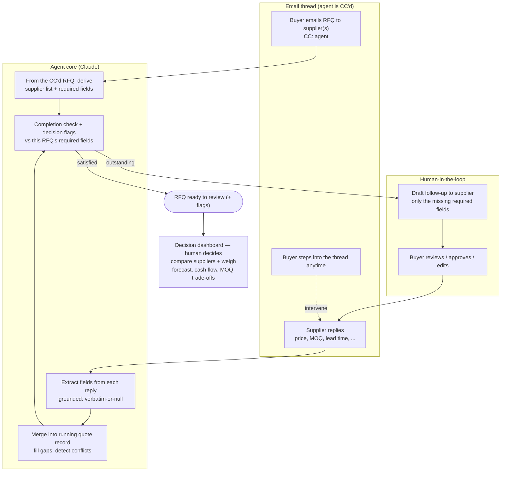
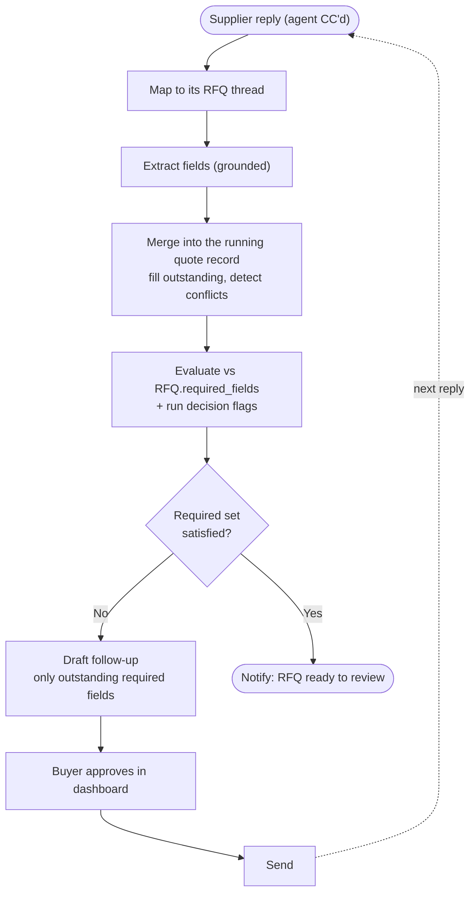

# ForgeFlow

ForgeFlow is a local-first email assistant for **procurement and sourcing teams**. The buyer CCs it on outbound RFQ emails; from there it triages supplier replies, extracts structured pricing and lead-time data, and drafts follow-ups when key information is missing — looping with suppliers until each RFQ is complete.

## The problem it solves

When a buyer sends RFQs to multiple suppliers, the responses come back in unstructured email form — varying formats, missing fields, inconsistent terminology. Reviewing each response manually is time-consuming and error-prone. ForgeFlow automates the triage layer so buyers can focus on decision-making rather than inbox management.

## System architecture

ForgeFlow is an **LLM agent (Claude)** that rides along on the buyer's own RFQ emails. **The buyer sends each RFQ to suppliers and CCs the agent — that CC is the trigger.** From the CC'd RFQ the agent learns two things at once: *which suppliers* to chase (the recipients) and *which fields this RFQ requires* (the buyer's ask defines them, so RFQ-1 might need `{unit price, MOQ, lead time, COO}` while RFQ-2 needs only `{price, material}`). It then works the thread — following up with each supplier, iterating until that RFQ's required set is satisfied, and aggregating results for the buyer's decision. Because it all happens in a normal email thread the buyer is already on, **the buyer can step in at any time.**



**Layers**

- **Trigger (CC)** — the buyer emails the RFQ to suppliers and CCs the agent; that single email gives the agent the supplier list *and* this RFQ's required-field set. No inbox-guessing about who or what.
- **Agent core (Claude)** — extracts fields from each supplier reply with a strict *verbatim-or-null* grounding rule, merges them across rounds, checks completion against this RFQ's required fields, and raises decision flags.
- **Human-in-the-loop** — the agent drafts follow-ups (only the missing required fields) for the buyer to approve or edit; the buyer can also just reply in the thread directly. Nothing sends without approval.
- **Decision (human-owned)** — when the required set is satisfied, the buyer is notified and the quotes surface in a **decision dashboard**. The agent compares suppliers (landed cost incl. tariff by COO, lead time, MOQ feasibility) and lays out the trade-offs, but **the human makes the final call** — weighing factors the agent can't see, like demand forecast, cash flow, and sales-team input (e.g. accepting an MOQ of 1,500 for a 1,000-unit need because the price is right).

### How the agent works (per supplier reply)



The agent's **goal state** is "satisfy this RFQ's required set." That single objective drives the targeted follow-ups, prevents re-asking answered fields, and decides when to stop — all scoped to the individual RFQ. It also flags hidden-cost traps a price-only view misses (e.g. *MOQ 10,000 when you need 100*, or a 52-week lead time on the cheapest quote). The agent gathers and presents the full picture; **the final decision is always the buyer's.**

> **Status:** Claude extraction, the grounded eval (Promptfoo), and human-in-the-loop drafting/send are implemented. The CC trigger, per-RFQ requirement specs, cross-round merge, and the decision dashboard are the in-progress architecture shown above.

## What ForgeFlow extracts from supplier quote emails

- **Price breaks** — e.g. `100@$24.00, 500@$18.00, 1000@$15.00`
- **Production lead time** — e.g. `8 weeks`
- **Long lead time components** — part numbers with lead time ≥ 8 weeks
- **MOQ** — minimum order quantity if stated
- **Payment terms** — e.g. `Net 30`
- **NRE** — non-recurring engineering cost if applicable
- **COO** — country of origin (relevant for landed cost comparison)
- **Missing fields** — flags what needs to be followed up with the supplier

## Quote classification

Each supplier email thread is classified into one of:

| Classification | Meaning |
|---|---|
| `quote_received` | Supplier sent a complete quote |
| `quote_incomplete` | Quote received but key fields are missing |
| `supplier_followup` | Supplier is following up on a previously sent quote |
| `ignore` | Not actionable |

## Draft generation

When a quote is incomplete, ForgeFlow automatically drafts a follow-up email to the supplier requesting the missing information. Buyers review and approve before sending.

## Project structure

```
src/forgeflow/         # core app code
data/sample_emails/    # 5 sample supplier quote emails for testing
data/eval_cases/       # evaluation test cases with expected extraction results
data/outbox/           # local sent-output directory
data/forgeflow.db      # SQLite database (created at runtime)
docs/                  # workflow and setup documentation
```

## Quick start (local mode)

```bash
PYTHONPATH=src python3 -m forgeflow.cli init
PYTHONPATH=src python3 -m forgeflow.cli sync
PYTHONPATH=src python3 -m forgeflow.cli list-cases
PYTHONPATH=src python3 -m forgeflow.cli list-drafts
```

Send a draft reply to a supplier:

```bash
PYTHONPATH=src python3 -m forgeflow.cli send <thread_id>
```

## Outlook mode

ForgeFlow connects to a real Outlook mailbox via Microsoft Graph.

Required environment variables:

```bash
export FORGEFLOW_OUTLOOK_ACCESS_TOKEN="..."
export FORGEFLOW_OUTLOOK_MAILBOX="quotes@yourcompany.com"
```

Run with `--provider outlook`:

```bash
PYTHONPATH=src python3 -m forgeflow.cli --provider outlook sync
PYTHONPATH=src python3 -m forgeflow.cli --provider outlook list-cases
PYTHONPATH=src python3 -m forgeflow.cli --provider outlook list-drafts
```

See `docs/microsoft_graph_setup.md` for full setup instructions.

## How it works

1. The buyer emails an RFQ to suppliers and CCs the agent — that CC is the trigger
2. From the CC'd RFQ the agent derives the supplier list and that RFQ's required-field spec
3. Claude extracts structured fields from each supplier reply (grounded: only values present in the email)
4. Fields are merged into a running per-supplier quote record across multiple reply rounds
5. Completion is checked against that RFQ's required fields; decision flags (MOQ vs needed qty, long lead time, COO/tariff) are raised
6. If required fields are still missing, a targeted follow-up is drafted (only the gaps) for buyer approval, and the loop continues on the next reply
7. When the RFQ's required set is satisfied, the buyer is notified that it's ready to review

## Roadmap

- [ ] Automated supplier follow-up when RFQ due date is approaching (Issue #4)
- [ ] LLM-assisted extraction for unstructured quote formats
- [ ] Attachment parsing (Excel/PDF quote sheets)
- [ ] Multi-supplier comparison view
- [ ] Scheduled sync and follow-up reminders
- [ ] Full OAuth flow for production Outlook integration
