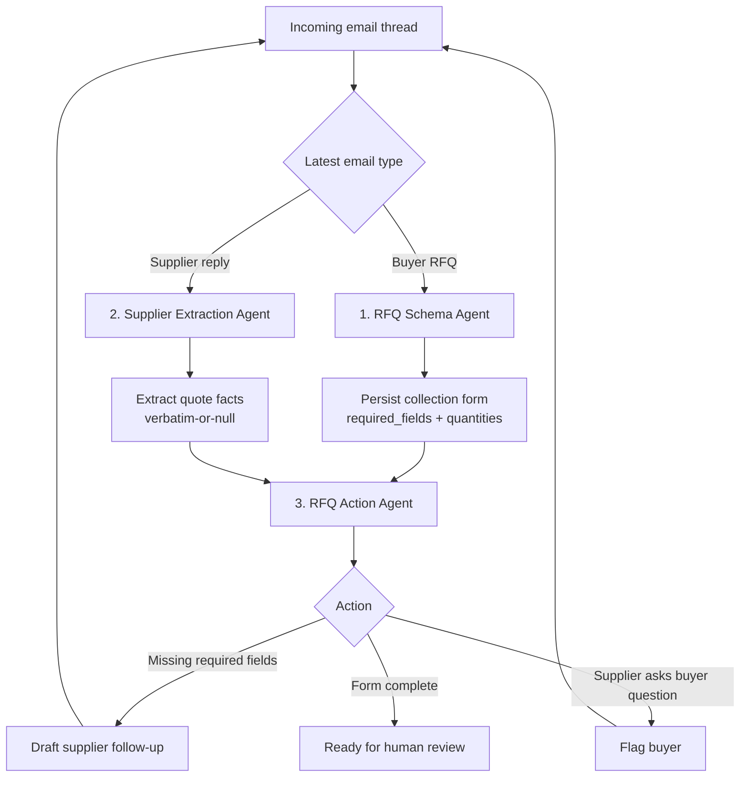

# ForgeFlow

ForgeFlow is a local-first email assistant for **procurement and sourcing teams**. The buyer CCs it on outbound RFQ emails; from there it triages supplier replies, extracts structured pricing and lead-time data, and drafts follow-ups when key information is missing — looping with suppliers until each RFQ is complete.

## The problem it solves

When a buyer sends RFQs to multiple suppliers, the responses come back in unstructured email form — varying formats, missing fields, inconsistent terminology. Reviewing each response manually is time-consuming and error-prone. ForgeFlow automates the triage layer so buyers can focus on decision-making rather than inbox management.

## Agent Workflow

ForgeFlow uses three agents. The operating rule is simple: **the buyer's RFQ creates the form, supplier replies fill the form, and the action agent decides what is still needed.**



**Agent responsibilities**

- **RFQ Schema Agent**: reads the buyer's original RFQ and creates the dynamic collection form for that thread. This is the source of truth for required fields.
- **Supplier Extraction Agent**: reads supplier replies and extracts quote facts from the visible thread. It only extracts what is present.
- **RFQ Action Agent**: compares the supplier extraction against the persisted collection form, then chooses one action: draft follow-up, flag buyer, or mark ready for review.

**Iteration**

1. Buyer RFQ arrives → create and persist the collection form.
2. Supplier reply arrives → extract quote facts.
3. Action agent checks the extraction against the form.
4. If information is missing, generate a targeted reply asking only for the missing required fields.
5. When the supplier replies again, repeat extraction and action against the same persisted form.
6. When all required fields are populated, show the quote as ready for human review in the dashboard.

The corresponding prompts live in:

- `src/forgeflow/prompts/extraction.txt` — Extraction Agent (classification + RFQ form + quote)
- `src/forgeflow/prompts/response.txt` — Response Agent (picks the action and writes the copy)

## What ForgeFlow extracts from supplier quote emails

- **Price breaks** — e.g. `100@$24.00, 500@$18.00, 1000@$15.00`
- **Production lead time** — e.g. `8 weeks`
- **Long lead time components** — part numbers with lead time ≥ 8 weeks
- **MOQ** — minimum order quantity if stated
- **Payment terms** — e.g. `Net 30`
- **NRE** — non-recurring engineering cost if applicable
- **COO** — country of origin (relevant for landed cost comparison)
- **Missing fields** — flags what needs to be followed up with the supplier

## Quote classification

Each supplier email thread is classified into one of:

| Classification | Meaning |
|---|---|
| `quote_received` | Supplier sent a quote (complete or partial — missing fields are checked separately) |
| `supplier_reminder` | Supplier is chasing buyer for a response on a previously sent quote |
| `ignore` | Not actionable (buyer outbound emails, spam, etc.) |

> **Note:** `quote_incomplete` is a *status* derived by the workflow layer when a `quote_received` email is missing required fields — it is not a classification.

## Draft generation

When a quote is incomplete, ForgeFlow automatically drafts a follow-up email to the supplier requesting the missing information. Buyers review and approve before sending.

## Project structure

```
src/forgeflow/         # core app code
data/sample_emails/    # sample supplier quote emails for eval testing
data/eval_cases/       # evaluation test cases with expected extraction results
data/outbox/           # local sent-output directory
data/forgeflow.db      # SQLite database (created at runtime)
docs/                  # workflow and setup documentation
```

## Quick start (local mode)

```bash
PYTHONPATH=src python3 -m forgeflow.cli sync-local data/sample_inbox
PYTHONPATH=src python3 -m forgeflow.cli process
PYTHONPATH=src python3 -m forgeflow.cli dashboard --port 8000
```

Start the Next.js dashboard in a second terminal:

```bash
cd next-ui
npm install
npm run dev
```

The dashboard opens at `http://127.0.0.1:3000` and calls the Python API at `http://127.0.0.1:8000`.

### Local RFQ playground

Use the **Playground** tab in the Next.js dashboard to test realistic RFQ back-and-forth without Outlook:

- Start a new manual thread
- Add the buyer's RFQ as the first message
- Add supplier replies one at a time
- Run the current thread after each reply
- Inspect which agent responded, the RFQ collection schema, extracted quote fields, missing items, flags, and generated follow-up

The playground uses the same parser, agent pipeline, SQLite state tables, and dashboard rendering as real Outlook sync.

You can also run bundled sample scenarios from the Playground tab, or call the simulator API directly:

```bash
curl -sS http://127.0.0.1:8000/api/simulator/scenarios
```

Rebuild persisted RFQ state from already-processed interactions:

```bash
PYTHONPATH=src python3 -m forgeflow.cli rebuild-state
PYTHONPATH=src python3 -m forgeflow.cli list-rfqs
```

Run the LLM eval cases offline:

```bash
PYTHONPATH=src python3 -m forgeflow.cli eval
```

## Outlook mode

ForgeFlow connects to the Outlook mailbox `forgeflow.demo@outlook.com` via Microsoft Graph.

Required environment variables:

```bash
export FORGEFLOW_OUTLOOK_ACCESS_TOKEN="..."
export FORGEFLOW_OUTLOOK_AUTH_MODE="delegated"
export FORGEFLOW_OUTLOOK_MAILBOX="me"
```

For a personal Outlook.com mailbox, first sign in with delegated OAuth:

```bash
PYTHONPATH=src python3 -m forgeflow.cli login-outlook
```

You only sign in once. The short-lived access token is refreshed automatically (using the saved refresh token) whenever Graph returns a 401, so long-running pollers keep working without re-authentication. You only need to run `login-outlook` again if the refresh token itself is revoked (password change, consent removed, or a security challenge) — in which case commands fail with `Outlook 登录已失效,请重新运行: forgeflow login-outlook`.

Pull recent Outlook messages into the local processing log:

```bash
PYTHONPATH=src python3 -m forgeflow.cli sync-outlook
PYTHONPATH=src python3 -m forgeflow.cli process
PYTHONPATH=src python3 -m forgeflow.cli dashboard --port 8000
```

Then run the frontend:

```bash
cd next-ui
npm run dev
```

Run a local poller so new Outlook mail triggers processing:

```bash
PYTHONPATH=src python3 -m forgeflow.cli watch-outlook --seconds 60
```

Review generated reply drafts without sending:

```bash
PYTHONPATH=src python3 -m forgeflow.cli send-replies
```

Send those replies after review:

```bash
PYTHONPATH=src python3 -m forgeflow.cli send-replies --yes
```

For local testing, click **Sync Outlook** in the dashboard once you've signed in via `login-outlook` (the access token refreshes itself as needed — no need to paste a fresh token). Later deployment can replace this polling entrypoint with a Microsoft Graph change notification webhook while keeping the same processor and store contract.

## How it works

1. The buyer emails an RFQ to suppliers and CCs the agent — that CC is the trigger
2. From the CC'd RFQ the agent derives the supplier list and that RFQ's required-field spec
3. Claude extracts structured fields from each supplier reply (grounded: only values present in the email)
4. Fields are merged into a running per-supplier quote record across multiple reply rounds
5. Completion is checked against that RFQ's required fields; decision flags (MOQ vs needed qty, long lead time, COO/tariff) are raised
6. If required fields are still missing, a targeted follow-up is drafted (only the gaps) for buyer approval, and the loop continues on the next reply
7. When the RFQ's required set is satisfied, the buyer is notified that it's ready to review

## Roadmap

- [ ] Automated supplier follow-up when RFQ due date is approaching (Issue #4)
- [ ] LLM-assisted extraction for unstructured quote formats
- [ ] Attachment parsing (Excel/PDF quote sheets)
- [ ] Multi-supplier comparison view
- [ ] Scheduled sync and follow-up reminders
- [x] Automatic access-token refresh (delegated OAuth); one-time sign-in via `login-outlook`
- [ ] Full OAuth flow for production Outlook integration
