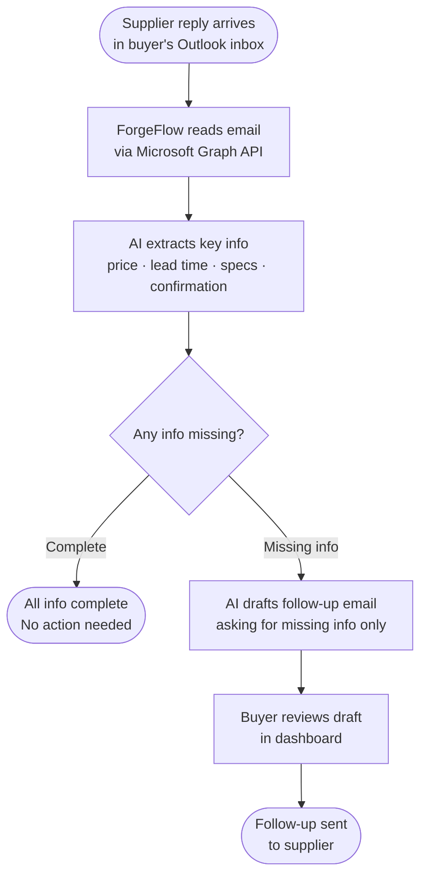

# ForgeFlow Agent Workflow

This document describes how the ForgeFlow agent processes incoming supplier emails end-to-end.

## Overview

ForgeFlow helps manufacturing buyers manage RFQ replies directly from their Outlook inbox. Instead of manually reading each supplier email and chasing missing information, the agent reads, extracts, flags, and drafts follow-up emails automatically.

## Workflow Diagram

## Step-by-step Description

**Step 1 — Supplier reply arrives**
The supplier sends a reply to the buyer's existing RFQ thread. No new inbox or tool is required — ForgeFlow monitors the buyer's existing Outlook inbox.

**Step 2 — ForgeFlow reads the email**
The agent connects to Outlook via Microsoft Graph API and reads the latest supplier reply.

**Step 3 — AI extracts key information**
Using Claude, the agent parses the email and extracts four key fields:
- **Price** — unit price or total quote
- **Lead time** — delivery or production timeline
- **Specs** — product specifications or confirmation of requirements
- **Confirmation** — whether the supplier confirmed the order terms

**Step 4 — Flag missing information**
The agent checks which of the four fields are present. Any missing fields are flagged for follow-up.

**Step 5 — Draft follow-up email**
If any information is missing, the agent automatically drafts a follow-up email addressed to the supplier, asking only for the missing fields. The draft is concise and professional.

**Step 6 — Buyer reviews in dashboard**
The buyer sees the draft in the ForgeFlow dashboard before anything is sent. They can edit the content or approve it as-is.

**Step 7 — Follow-up sent**
Once approved, the follow-up is sent to the supplier directly from the buyer's Outlook account.

## Design Principles

- **Non-disruptive** — works within the buyer's existing email workflow, no new tools required
- **Buyer in control** — nothing is sent without the buyer's explicit approval
- **Targeted follow-ups** — drafts ask only for what is missing, not a generic checklist
- **Auditable** — every extracted field and draft is visible in the dashboard
