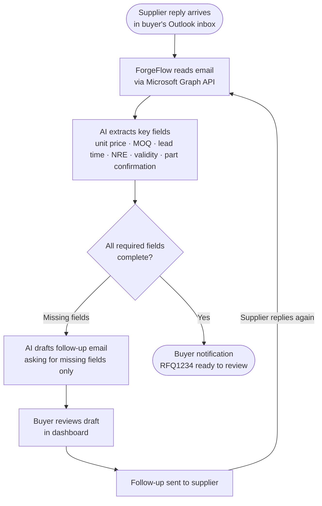

# ForgeFlow Agent Workflow

This document describes how the ForgeFlow agent processes incoming supplier emails end-to-end.

## Overview

ForgeFlow helps manufacturing buyers manage RFQ replies directly from their Outlook inbox. Instead of manually reading each supplier email and chasing missing information, the agent reads, extracts, flags, and drafts follow-up emails automatically — looping until all required fields are received, then notifying the buyer that the quote is ready to review.

## Workflow Diagram

## Step-by-step Description

**Step 1 — Supplier reply arrives**
The supplier sends a reply to the buyer's existing RFQ thread. ForgeFlow monitors the buyer's existing Outlook inbox — no new email address or tool required.

**Step 2 — ForgeFlow reads the email**
The agent connects to Outlook via Microsoft Graph API and reads the latest supplier reply.

**Step 3 — AI extracts key fields**
Using Claude, the agent parses the email and extracts the following fields:

| Field | Required | Notes |
|-------|----------|-------|
| Unit price | ✅ | Per-unit cost at quoted quantity |
| MOQ | ✅ | Minimum order quantity |
| Lead time | ✅ | Production lead time in weeks |
| NRE cost | ⚠️ | Required if tooling or setup is involved |
| Quote validity date | ⚠️ | Date until which the price is guaranteed |
| Long lead time flag | ✅ | Any component with lead time > 12 weeks |
| Part number confirmation | ✅ | Supplier confirms the correct part |

**Step 4 — Check for missing fields**
The agent checks which fields are present. Any missing required fields are flagged.

**Step 5 — Draft follow-up email**
If any fields are missing, the agent drafts a follow-up email asking the supplier only for the missing information. The draft is concise and professional.

**Step 6 — Buyer reviews in dashboard**
The buyer sees the draft in the ForgeFlow dashboard before anything is sent. They can edit or approve.

**Step 7 — Follow-up sent; loop continues**
Once approved, the follow-up is sent. ForgeFlow continues monitoring the inbox. When the supplier replies again, the agent repeats Steps 2–6 until all fields are complete.

**Step 8 — Buyer notification**
Once all required fields are confirmed, ForgeFlow notifies the buyer:
> "RFQ1234 is ready to review."

The buyer can then open the dashboard to review the full quote and decide next steps.

## Design Principles

- **Non-disruptive** — works within the buyer's existing email workflow, no new tools required
- **Buyer in control** — nothing is sent without the buyer's explicit approval
- **Targeted follow-ups** — drafts ask only for what is missing, not a generic checklist
- **Loop until complete** — automatically tracks each supplier thread until the quote is fully qualified
- **Notify when ready** — buyer is only alerted when a quote is genuinely complete and actionable
- **Auditable** — every extracted field and draft is visible in the dashboard
